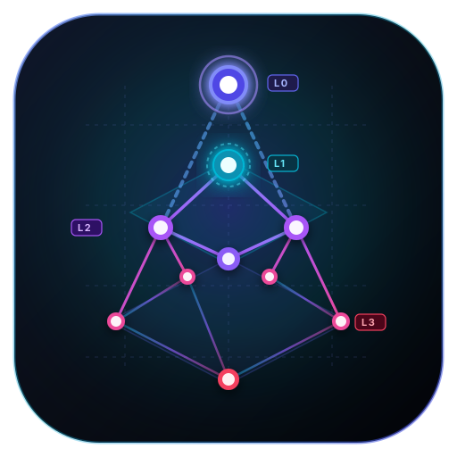

<p align="center">
  
</p>

<h1 align="center">Meta-Lattice (Go Native)</h1>

<p align="center">
  <strong>Hierarchical Context Zoomer · Architecture Boundary Auditor · Blast Radius Estimator · Incremental AST Cache</strong><br>
  <em>Native Standalone Go Implementation with Embedded LatticeDB & Multi-Language Parsers</em>
</p>

<p align="center">
  <a href="LICENSE"></a>
  <a href="https://golang.org"></a>
  <a href="https://github.com/jeffhajewski/latticedb"></a>
  <a href="#-빌드-및-크로스-컴파일-building--cross-compilation"></a>
  <a href="https://modelcontextprotocol.io"></a>
  <a href="#-단위-테스트-검증-test-results"></a>
</p>

<p align="center">
  <a href="README.md">🇺🇸 English</a> · <strong>🇰🇷 한국어</strong>
</p>

---

## 📖 개요 (Overview)

**Meta-Lattice (Go Native)**는 **Claude Code**, **OpenAI Codex**, **Google Antigravity** 환경에서 AI 에이전트의 컨텍스트 토큰 소비를 줄이고(절감률은 사용 방식과 저장소에 따라 다르며, 측정 예시는 [docs/utility-and-performance.ko.md](docs/utility-and-performance.ko.md) 참고), 아키텍처 규칙 위반과 변경 영향 범위를 사전에 점검할 수 있도록 Go 언어로 개발된 고성능 도구입니다.

공식 [LatticeDB](https://github.com/jeffhajewski/latticedb) v0.15.0 CGO 바인딩을 탑재하여 임베디드 단일 파일 프로퍼티 그래프(`.lattice/knowledge.lattice`)로 소스코드 지식 그래프를 영속화하며, 배포 패키지에는 플랫폼별 네이티브 공유 라이브러리(`liblattice.dylib` / `liblattice.so`)가 번들링되어 추가 환경 설정 없이 즉시 실행됩니다. (CGO 비활성화 환경에서는 내장 순수 Go 엔진으로 자동 폴백 지원)

---

## 🏛 주요 특징 (Key Advantages)

- **공식 LatticeDB 단일 파일 그래프 데이터베이스 탑재**: 공식 `github.com/jeffhajewski/latticedb/bindings/go`를 통해 `.lattice/knowledge.lattice` 단일 바이너리 파일로 L0~L3 지식 그래프 및 엣지 관계를 관리하며, 고속 조회를 위한 B-Tree 프로퍼티 인덱스를 자동 생성합니다.
- **배포 아티팩트 내 네이티브 라이브러리 자동 번들링**: 릴리스 아카이브 내에 `liblattice` 동적 라이브러리와 RPATH(`@executable_path`, `$ORIGIN`)가 사전 구성되어 별도의 시스템 라이브러리 설치 없이 즉시 구동됩니다.
- **대규모 프로젝트 최적화 멀티코어 병렬 파싱**: `runtime.GOMAXPROCS(0)` 기반 워커 풀(Worker Pool)을 적용하여 수천~수만 개의 대규모 프로젝트 파일도 CPU 코어 수에 맞추어 초고속 병렬 파싱합니다.
- **엔터프라이즈 멀티 랭귀지 AST 파서 내장**: **Go**(`go/ast`, `go/parser`), **Python**, **TypeScript/JavaScript**, **Java**, **Kotlin**(`.kt`, `.kts`), **C#**(`.cs`), **Swift**(`.swift`), **PHP**(`.php`), **Rust**(`.rs`), **C/C++**(`.c`, `.cpp`, `.cc`, `.cxx`, `.h`, `.hpp`) 소스 코드를 네이티브 파싱하여 심볼, 시그니처, 클래스, 호출 그래프를 추출합니다. 프론트엔드 지원: **Vue SFC**(`.vue`), **Svelte**(`.svelte`), **React JSX/TSX**(JSX 사용 엣지, PascalCase 컴포넌트 판별), **Angular**(`@Component` 데코레이터 인식).
- **모노레포(Monorepo) 경로 매핑 지원**: TypeScript `tsconfig.json`의 경로 별칭(`@/*`, `~/*`) 및 모노레포 내 하위 디렉터리의 다중 `go.mod` 모듈 경로를 자동 감지하여 정확한 상호 파일 의존성 엣지를 구축합니다.
- **MCP (Model Context Protocol) 서버 내장**: `stdio` 기반 JSON-RPC 2.0 로 MCP(protocolVersion `2024-11-05`, `tools` 기능)를 구현하여 Codex, Antigravity, Claude Code에서 사용할 수 있습니다.

---

## 🚀 4대 핵심 기능 (Key Features)

### 1. 계층적 컨텍스트 줌 (Hierarchical Context Zoomer)
* **L0 (Domain/Package)**: 도메인 경계, 패키지별 모듈 개수, 최상위 역할 요약.
  * **토큰 가드 (Token Guard)**: 모듈 수가 50개를 초과하는 대규모 프로젝트에서 전체 개요 요청 시 도메인 단위 요약 모드(`summary_mode: true`)로 자동 전환하여 LLM 컨텍스트 윈도우 폭증을 원천 차단합니다. 특정 도메인 상세 조회가 필요할 경우 `zoom_overview(domain="...")`로 드릴다운할 수 있습니다.
* **L1 (Module/File)**: 파일 메타데이터(LOC, 언어, Docstring, export/import 목록).
* **L2 (Class/Interface)**: 클래스 상속 구조, 필드, **메서드 시그니처만 반환 (메서드 본문 생략으로 토큰 대폭 절감)**.
* **L3 (Function/Symbol)**: 문제 해결에 필요한 특정 함수의 전체 구현 코드, 파라미터, 호출 관계, 순환 복잡도(Cyclomatic Complexity).
* **BM25 전문 검색 (`zoom_search`)**: 내장 BM25 랭킹 알고리즘으로 심볼 및 시그니처를 밀리초 내 검색. `snake_case`와 `camelCase`를 하위 단어로 분리해 색인하므로 `symbol`로 `ZoomSymbol`을, `http`로 `parseHTTPServer`를 찾을 수 있습니다.

### 2. 레이어드 아키텍처 경계 및 결합도 감사기 (Architecture Boundary Auditor)
* **계층 규칙 감사**: 소스코드의 `import` 구문을 추적하여 단방향 계층 원칙(`controller -> service -> repository -> model`) 위반을 실시간 감지.
* **순환 참조 탐지**: Tarjan SCC(Strongly Connected Components) 알고리즘으로 다단계 순환 참조(`A -> B -> C -> A`)를 즉시 감지.
* **결합도 메트릭**: 구심 결합도($C_a$), 원심 결합도($C_e$), 불안정성 지수($I = \frac{C_e}{C_a + C_e}$) 산출.

### 3. 변경 파급 시뮬레이터 (Blast Radius Estimator)
* **역방향 그래프 순회**: `CALLS`, `IMPORTS`, `REFERENCES` 그래프를 역방향 BFS 탐색 (`CONTAINS` 엣지 제외).
* **가중치 모델**: 홉 거리 감쇠($0.5^{d-1}$), 심볼 가시성(public 1.8배), 변경 유형(signature 2.0배, removal 2.5배 등), 도메인 교차(1.5배).
* **대규모 안전 가드 (Exploration Limit)**: 최상위 기반 유틸리티나 로거 등 호출 지점이 방대한 심볼을 변경할 때 BFS 탐색 상한선을 250개 노드로 제한(`truncated: true`)하고 가장 파괴적 영향이 큰 상위 지점을 우선 보고하여 지연 및 컨텍스트 초과를 방지합니다.
* **결과 브리핑**: 0~100 점수의 **Blast Score**, 4단계 리스크 티어(`CRITICAL`, `HIGH`, `MODERATE`, `LOW`), Top 10 파괴적 변경 지점 및 ASCII 영향 전파 트리 출력.

### 4. 증분 AST 인덱서 & 로컬 캐시 엔진 (Incremental AST Cache)
* **SHA-256 & Mtime 매핑**: 파일 SHA-256 해시와 mtime을 캐시 상태(`.lattice/cache_state.json`, v1.3)에 기록. 캐시 버전이 다르면 다음 sync에서 자동으로 전체 재인덱싱합니다.
* **국소적 델타 엣지 갱신 (Localized Delta Invalidation)**: 파일이 수정되었을 때 전체 그래프를 지우지 않고 변경된 파일과 직접 관련된 의존 엣지만 $O(\Delta)$로 선별 삭제 후 갱신하여 수만 개 파일 환경에서도 밀리초 단위 재동기화를 달성합니다.
* **상호 파일 의존성 자동 복원**: 파일 간 `IMPORTS` 엣지와 L3 심볼 간 최적 스코프(동일 클래스 우선, 동일 파일 우선, import된 파일 우선) `CALLS` 엣지를 자동 연결.
  * **Go**: 패키지 import를 `go.mod`의 module 경로 기준으로 해석해, 워크스페이스 내부 패키지의 (테스트 파일을 제외한) `.go` 파일에 `IMPORTS` 엣지를 연결합니다. 다중 `go.mod` 모노레포도 지원합니다.
  * **TypeScript / JavaScript**: 상대/절대 import 및 `tsconfig.json` path alias(`@/*`, `~/*`)를 파일 경로로 자동 해석합니다.
  * **Python / Java / Rust / C/C++**: 각 언어 표준 및 상대 경로 import/include를 파일 경로로 해석합니다.
* **자동 복구**: `knowledge.lattice`가 삭제되었거나 손상된 경우(`.corrupt`로 보존 후 stderr에 경고) 다음 sync에서 자동으로 전체 재인덱싱합니다.
* **지연 인덱싱 (MCP)**: 그래프가 비어 있는 상태에서 조회 도구(`zoom_*`, `check_layer_violation`, `estimate_blast_radius`)를 호출하면 먼저 자동으로 sync합니다. 이후의 변경 반영은 `sync_index`를 호출해야 합니다.

#### 인덱싱 제외 규칙
* **디렉터리 이름 패턴** (`.git`, `node_modules`, `dist`, `build`, `out`, `bin`, `target`, `obj`, `ref`, `venv` 등)은 **디렉터리에만** 적용됩니다. 따라서 `out.py`, `ref.go` 같은 파일은 정상적으로 인덱싱됩니다.
* **파일 패턴** (`*.min.js`, `*.bundle.js`, `*.map`, `package-lock.json`, `yarn.lock`, `pnpm-lock.yaml`)은 파일에 적용됩니다.
* **워크스페이스 커스텀 제외 (`.latticeignore`)**: 저장소 루트에 `.latticeignore` 파일을 두면 한 줄당 하나의 glob 패턴(빈 줄·`#` 주석 무시, 중복 자동 제거)이 기본 제외 목록에 추가됩니다. 생성 코드·벤더 트리·스냅샷 등 대규모 모노레포 전용 제외에 사용하세요.
* 무시 규칙을 바꾼 뒤에는 `./meta-lattice sync --force`로 인덱스를 다시 만드세요.

---

## 🛠 빌드 및 크로스 컴파일 (Building & Cross-Compilation)

**Docker-first**: 호스트에 Go/CGO 툴체인이 없어도 됩니다. `scripts/docker-build.sh`가 호스트 소스를 컨테이너(`/work`)에 바인드 마운트하여 재현 가능한 Go 툴체인으로 빌드합니다.

```bash
# 빌더 이미지 준비 (최초 1회; 이후 자동 재사용)
make docker-builder

# 1. 윈도우용 LatticeDB DLL 컴파일 (Zig Docker 활용)
make latticedb-dll   # deps/latticedb/lib/windows-amd64/lattice.dll 생성

# 2. LatticeDB 연동 버전 (Native CGO)
make build-native    # 호스트 플랫폼 네이티브 빌드
make windows-native  # 윈도우 x86_64 네이티브 빌드 (meta-lattice.exe + lattice.dll)

# 3. LatticeDB 없는 버전 (Pure-Go 독립 실행형, nolattice)
make build-nolattice # 호스트 플랫폼 순수 Go 빌드
make windows-nolattice # 윈도우 x86_64 순수 Go 빌드

# 4. 전체 빌드 및 패키징
make build-all-flavors # 모든 플랫폼별 Native 및 Nolattice 버전 일괄 빌드 (dist/flavors/)
make package           # 전 플랫폼 릴리스 아카이브 (dist/)
```

### 빌드 매트릭스: 네이티브 LatticeDB vs 내장 순수 Go 엔진

| 빌드 명령 | CGO / 태그 | 사용 엔진 (`status` 확인) | 산출물 및 특징 |
| :--- | :---: | :--- | :--- |
| `make windows-native` | ON (`CGO_ENABLED=1`) | LatticeDB v0.15.0 | `meta-lattice.exe` + `lattice.dll` 번들링 (고속 B-Tree 프로퍼티 그래프) |
| `make windows-nolattice` | OFF (`-tags nolattice`) | Embedded Go Property-Graph | `meta-lattice.exe` 단일 바이너리 (추가 DLL 불필요, 독립 실행) |
| `make build-native` | ON (`CGO_ENABLED=1`) | LatticeDB v0.15.0 | 네이티브 공유 라이브러리(`liblattice.so` / `liblattice.dylib`) 링크 |
| `make build-nolattice` | OFF (`-tags nolattice`) | Embedded Go Property-Graph | 순수 Go 독립 실행 바이너리 |
| `make latticedb-dll` | - | - | Zig Docker 컨테이너를 통해 LatticeDB v0.15.0 소스를 `lattice.dll`로 크로스 컴파일 |
| `make build-all-flavors` | BOTH | BOTH | `dist/flavors/` 디렉토리에 전 플랫폼 Native 및 Nolattice 바이너리 동시 생성 |
```

### 1. 네이티브 바이너리 빌드 (macOS / Linux, 호스트 툴체인)
```bash
# 네이티브 빌드
go build -ldflags="-s -w" -o meta-lattice ./src

# 또는 간편 셸 스크립트 실행
./install.sh
```

### 2. 윈도우 x86 64-bit 크로스 컴파일 (Windows x86 64-bit / amd64)
macOS나 Linux 환경에서도 Go 내장 크로스 컴파일 기능으로 즉시 윈도우 64비트 실행 파일(`.exe`)을 생성할 수 있습니다:
```bash
# 윈도우 x86 64-bit 바이너리 컴파일
CGO_ENABLED=0 GOOS=windows GOARCH=amd64 go build -ldflags="-s -w" -o meta-lattice.exe ./src

# 윈도우 PowerShell 환경에서 자동 빌드 및 설치
powershell -ExecutionPolicy Bypass -File .\install.ps1
```

### 3. Makefile 사용 (빌드 및 패키징)
```bash
make build       # 호스트 바이너리 빌드 (meta-lattice, Docker 기본)
make windows     # 윈도우 x86 64-bit 바이너리 빌드 (meta-lattice.exe, Docker 기본)
make build-all   # 호스트 및 윈도우 바이너리 동시 빌드
make package     # 전 플랫폼(Windows, Linux, macOS) 릴리스 압축 아카이브 생성 (dist/, Docker 기본)
make test        # 단위/회귀 테스트 실행 (Docker 기본)
make docker-builder  # Docker Go 툴체인 이미지 (재)빌드
make docker-shell    # 빌더 컨테이너 대화형 셸

# 호스트 Go 툴체인으로 직접 빌드하려면 DOCKER=0
make build DOCKER=0
make test DOCKER=0
```

### 4. GitHub Actions 릴리스 및 자동 배포 (Release and Publish)
테스트 없이 Windows, Linux, macOS 바이너리를 초고속으로 빌드하고 필수 파일만 묶어 GitHub Releases에 자동 발행합니다.

- **트리거 방법**:
  1. **Git 태그 푸시**:
     ```bash
     git tag v1.0.0
     git push origin v1.0.0
     ```
  2. **GitHub 웹 UI 수동 실행 (`workflow_dispatch`)**:
     GitHub 저장소의 `Actions` 탭 -> `Release and Publish` -> `Run workflow` 클릭 (버전 태그 지정 가능).

- **배포 아티팩트 (dist/) - 각 OS당 2종 패키지 제공**:
  - **LatticeDB 네이티브 버전 (CGO + 네이티브 공유 라이브러리 번들링)**:
    - `meta-lattice-<version>-windows-amd64-latticedb.zip` (윈도우 64비트 + `lattice.dll`)
    - `meta-lattice-<version>-linux-amd64-latticedb.tar.gz` (리눅스 x86_64 + `liblattice.so`)
    - `meta-lattice-<version>-linux-arm64-latticedb.tar.gz` (리눅스 ARM64 + `liblattice.so`)
    - `meta-lattice-<version>-darwin-arm64-latticedb.tar.gz` (macOS Apple Silicon + `liblattice.dylib`)
    - `meta-lattice-<version>-darwin-amd64-latticedb.tar.gz` (macOS Intel + `liblattice.dylib`)
  - **순수 Go 독립 실행형 버전 (Zero-Dependency Standalone, 순수 Go 모듈)**:
    - `meta-lattice-<version>-windows-amd64-purego.zip` (윈도우 64비트 단일 exe)
    - `meta-lattice-<version>-linux-amd64-purego.tar.gz` (리눅스 x86_64 단일 바이너리)
    - `meta-lattice-<version>-linux-arm64-purego.tar.gz` (리눅스 ARM64 단일 바이너리)
    - `meta-lattice-<version>-darwin-arm64-purego.tar.gz` (macOS Apple Silicon 단일 바이너리)
    - `meta-lattice-<version>-darwin-amd64-purego.tar.gz` (macOS Intel 단일 바이너리)
  - `checksums.txt` (전체 아티팩트 SHA256 체크섬)

- **패키지 구성 (필수 파일만 번들링)**:
  - 실행 바이너리 (`meta-lattice` 또는 `meta-lattice.exe`)
  - 원클릭 설치 스크립트 (`install.sh` 또는 `install.ps1`)
  - 에이전트 스킬 (`skills/`) 및 슬래시 커맨드 (`commands/`)
  - `README.md`, `LICENSE`

---

---

## 🚀 에이전트 원클릭 설치 및 연동 가이드 (Installation Guide)

Meta-Lattice는 **Claude Code (플러그인 및 MCP)**, **OpenAI Codex**, **Google Antigravity**를 위한 원클릭 자동 설치 명령을 내장하고 있으며, 각 플랫폼의 플러그인 규격과 설정 파일 표준을 완벽히 지원합니다.

### 1. 원클릭 전체 설치 (All-in-One)
한 번의 명령으로 세 플랫폼(Claude Code, Codex, Antigravity)의 MCP 서버 설정과 전용 커맨드/스킬을 일괄 등록합니다:

```bash
# macOS / Linux
./install.sh

# Windows (PowerShell)
powershell -ExecutionPolicy Bypass -File .\install.ps1

# 또는 컴파일된 바이너리로 직접 실행
./meta-lattice install
```

---

### 2. 플랫폼별 상세 설치 및 연동 방법

---

#### 🟣 Claude Code 설치 및 연동

Claude Code에서는 **(1) 플러그인(Plugin) 방식**, **(2) 자동 설치기 방식**, **(3) MCP 직접 등록 방식** 중 원하는 형태로 설치할 수 있습니다.

##### 방법 A. Claude Code 플러그인(Plugin)으로 설치
Meta-Lattice는 Claude Code 공식 플러그인 규격([`.claude-plugin/plugin.json`](file:///.claude-plugin/plugin.json)) 및 마켓플레이스 규격([`.claude-plugin/marketplace.json`](file:///.claude-plugin/marketplace.json))을 갖추고 있습니다.

1. **로컬 폴더에서 마켓플레이스 등록 및 설치**:
   ```bash
   # 1. 압축 해제된 폴더에서 로컬 마켓플레이스 추가 (반드시 './' 경로로 입력)
   claude plugin marketplace add ./

   # 2. meta-lattice 플러그인 설치 (플러그인 이름 지정)
   claude plugin install meta-lattice
   ```

2. **GitHub 원격 마켓플레이스로 직접 등록 및 설치**:
   ```bash
   # GitHub 저장소를 마켓플레이스로 추가 후 플러그인 설치
   claude plugin marketplace add sleekhan/meta-lattice
   claude plugin install meta-lattice
   ```

##### 방법 B. Meta-Lattice 자동 설치기 사용 (권장)
```bash
./meta-lattice install --claude
```
- **글로벌 MCP 등록**: `~/.claude.json`의 `mcpServers.meta-lattice`에 바이너리 경로가 자동 추가됩니다.
- **슬래시 커맨드 자동 배포**: `~/.claude/commands/`에 아래 6대 커맨드가 즉시 배치되어 대화 중 `/`를 눌러 바로 호출할 수 있습니다.
  - `/zoom`: 계층적 컨텍스트 탐색 (L0 도메인 -> L3 심볼 구현)
  - `/audit`: 단방향 레이어 아키텍처 및 순환 참조 감사
  - `/blast`: 변경 전 파급 영향도(Blast Score) 시뮬레이션
  - `/sync`: 증분 AST 캐시 동기화
  - `/scaffold`: 언어별 템플릿 신규 모듈 생성
  - `/apply`: 파일 편집 배치 적용 (dry-run 검증 + 롤백)

##### 방법 C. Claude Code CLI로 직접 MCP 등록
```bash
claude mcp add meta-lattice $(pwd)/meta-lattice mcp
```

##### 방법 D. 프로젝트 단위 워크스페이스 설정 (`.mcp.json`)
저장소 루트에 [`.mcp.json`](file:///.mcp.json) 파일을 생성하면 팀원 전체가 별도 설정 없이 프로젝트 진입 시 자동으로 Meta-Lattice를 사용할 수 있습니다:
```json
{
  "mcpServers": {
    "meta-lattice": {
      "command": "./meta-lattice",
      "args": ["mcp"]
    }
  }
}
```

---

#### 🟢 OpenAI Codex 설치 및 연동

OpenAI Codex 환경에서는 글로벌 설정 파일 또는 프로젝트별 설정을 통해 MCP 서버를 연동하고, 에이전트 지침서([`AGENTS.md`](file:///AGENTS.md))를 통해 최적의 탐색 동작을 수행하도록 합니다.

##### 방법 A. Meta-Lattice 자동 설치기 사용 (권장)
```bash
./meta-lattice install --codex
```
- **글로벌 설정 자동 갱신**: `~/.codex/config.toml`에 `[mcp_servers.meta-lattice]` 블록을 안전하게 추가(기존 설정 보존 및 중복 방지)합니다.

##### 방법 B. 글로벌 설정 직접 편집 (`~/.codex/config.toml`)
```toml
[mcp_servers.meta-lattice]
enabled = true
command = "/절대경로/meta-lattice"
args = ["mcp"]
```

##### 방법 C. 프로젝트 로컬 설정 (`.codex/config.toml`)
프로젝트 루트의 [`.codex/config.toml`](file:///.codex/config.toml)에 등록하여 워크스페이스별로 격리 구동:
```toml
[mcp_servers.meta-lattice]
enabled = true
command = "./meta-lattice"
args = ["mcp"]
```

##### 📋 Codex 에이전트 가이드라인 연동 (`AGENTS.md`)
Codex는 프로젝트 루트의 [`AGENTS.md`](file:///AGENTS.md)를 자동으로 로드하여 아래 행동 강령을 준수합니다:
- **점진적 줌 드릴다운**: 다수의 파일을 무분별하게 읽지 않고 `zoom_overview` -> `zoom_module` -> `zoom_symbol` 순서로 조회하여 컨텍스트 낭비 방지.
- **아키텍처 가드레일**: 다중 파일 리팩터링 완료 전 `check_layer_violation()` 실행 필수.
- **파괴적 변경 방지**: 공통 함수 및 인터페이스 수정 전 `estimate_blast_radius(...)` 사전 시뮬레이션.

---

#### 🔵 Google Antigravity 설치 및 연동 (CLI & IDE)

Google Antigravity(IDE 및 CLI) 환경에서는 MCP 서버 연동과 더불어 **5대 에이전트 스킬(Skills)**, **운영 규칙(GEMINI.md)**, **자동 훅(Hooks)**을 통합 구성합니다.

##### 방법 A. Meta-Lattice 자동 설치기 사용 (권장)
```bash
./meta-lattice install --antigravity
```
- **MCP 서버 등록**: `~/.gemini/config/mcp_config.json`에 `meta-lattice` 서버를 자동 등록합니다.
- **5대 에이전트 스킬 자동 배포**: `~/.gemini/config/skills/`에 스킬 매니페스트([`SKILL.md`](file:///skills/hierarchical-zoom/SKILL.md))를 자동 생성하여 Antigravity가 작업 상황에 맞춰 자율적으로 도구를 선택할 수 있게 합니다.

##### 방법 B. 글로벌 수동 설정 (`~/.gemini/config/mcp_config.json`)
```json
{
  "mcpServers": {
    "meta-lattice": {
      "command": "/절대경로/meta-lattice",
      "args": ["mcp"]
    }
  }
}
```

##### 방법 C. 프로젝트 로컬 설정 (`.agents/mcp_config.json`)
프로젝트 루트의 [`.agents/mcp_config.json`](file:///.agents/mcp_config.json)에 등록하여 프로젝트별 독립 실행:
```json
{
  "mcpServers": {
    "meta-lattice": {
      "command": "./meta-lattice",
      "args": ["mcp"]
    }
  }
}
```

##### 🧠 Antigravity 스킬 및 규칙 시스템 연동
1. **스킬 명세서 (Skills)**:
   - [`.agents/skills/hierarchical-zoom/SKILL.md`](file:///.agents/skills/hierarchical-zoom/SKILL.md): 토큰 80%+ 절감을 위한 계층적 줌 워크플로우
   - [`.agents/skills/architecture-auditor/SKILL.md`](file:///.agents/skills/architecture-auditor/SKILL.md): 단방향 계층 및 순환 참조 감사 워크플로우
   - [`.agents/skills/blast-radius/SKILL.md`](file:///.agents/skills/blast-radius/SKILL.md): 리팩터링 전 파급 반경 시뮬레이션 워크플로우
   - [`.agents/skills/incremental-cache/SKILL.md`](file:///.agents/skills/incremental-cache/SKILL.md): AST 증분 캐시 최신화 워크플로우
2. **에이전트 규칙 룰북 (`GEMINI.md`)**:
   - 프로젝트 루트의 [`GEMINI.md`](file:///GEMINI.md)에 Antigravity 에이전트가 코딩 작업 시 반드시 준수해야 하는 운영 지침이 정의되어 있습니다.
3. **자동 훅 연동 (`hooks/hooks.json`)**:
   - 코드 편집 시 백그라운드에서 증분 캐시를 즉시 최신화하도록 훅([`hooks/hooks.json`](file:///hooks/hooks.json))을 연동할 수 있습니다.

---

### 3. 설치 상태 점검 및 안전 제거 (Status & Uninstall)

```bash
# 전체 플랫폼 설치 상태 점검 (MCP 등록 여부 및 스킬/커맨드 설치 수량 일괄 확인)
./meta-lattice install --status

# 등록된 모든 플랫폼 설정 및 스킬/커맨드 안전 제거
./meta-lattice install --uninstall

# 특정 플랫폼만 선별적으로 제거할 경우
./meta-lattice install --uninstall --claude
./meta-lattice install --uninstall --codex
./meta-lattice install --uninstall --antigravity
```

---

## 💻 CLI 사용법 (CLI Quickstart)

```bash
# 1. 고속 증분 인덱스 동기화 (전체 재인덱싱: --force)
./meta-lattice sync

# 2. 인덱스 상태 및 노드/엣지 현황 확인
./meta-lattice status

# 3. 계층적 컨텍스트 줌
./meta-lattice zoom overview                       # L0/L1 도메인 및 모듈 오버뷰
./meta-lattice zoom module src/indexer/go_parser.go # L1->L2 모듈 상세 (시그니처만 반환)
./meta-lattice zoom symbol ParseGoFile             # L3 함수 전체 구현 코드 및 호출 그래프
./meta-lattice zoom search BlastRadius             # BM25 전문 검색

# 4. 아키텍처 규칙 및 순환 참조 감사
./meta-lattice audit
./meta-lattice audit --file src/features/auditor/auditor.go

# 5. 변경 파급 영향도 시뮬레이션
./meta-lattice blast EstimateBlastRadius --type signature --hops 4

# 5b. 코드 생성 (스캐폴드 & 편집 플랜)
./meta-lattice scaffold --path svc/user_service.py --kind class --name UserService
./meta-lattice apply-plan --file plan.json            # dry-run 검증 (쓰기 없음)
./meta-lattice apply-plan --file plan.json --execute  # 실제 적용 (실패 시 롤백)

# 6. MCP 서버 구동 (stdio)
./meta-lattice mcp

# 7. 플랫폼 설치 상태 확인
./meta-lattice install --status

# 기계 판독 출력이 필요하면 --json (sync, status, zoom, audit, blast, scaffold, apply-plan)
./meta-lattice zoom search BlastRadius --json
./meta-lattice audit --json
```

---

## 🤖 AI 에이전트 연동 (MCP Tools)

| 도구명 (MCP Tool) | 매개변수 | 설명 |
| :--- | :--- | :--- |
| `zoom_overview` | `domain?: string` | L0/L1 도메인 및 모듈 목록 조회 (파일을 직접 읽는 것보다 적은 토큰) |
| `zoom_module` | `file_path: string` | L1->L2 모듈 상세: 클래스/인터페이스 시그니처만 반환 (본문 제외) |
| `zoom_symbol` | `symbol_name: string, file_path?: string` | L2->L3 심볼 상세: 특정 함수의 전체 구현 코드 및 호출 그래프 반환 |
| `zoom_search` | `query: string, level?: string, limit?: int` | BM25 전문 검색으로 심볼, 시그니처 즉시 검색 |
| `check_layer_violation` | `file_path?: string` | 계층 침범 및 순환 의존성, 모듈 결합도 감사 |
| `estimate_blast_radius` | `symbol_or_path: string, change_type?: string` | 변경 파급 영향도(Blast Score) 및 Top 10 파괴적 변경 지점 브리핑 |
| `sync_index` | `force?: bool` | 고속 증분 인덱스 동기화 |
| `get_index_status` | 없음 | 노드/엣지 현황 및 캐시 통계 확인 |
| `scaffold_module` | `file_path: string, kind?: string, name?: string, namespace?: string, imports?: string[], overwrite?: bool` | 코드 생성: 언어별 템플릿으로 신규 소스 파일 생성 (워크스페이스 한정, 기본 덮어쓰기 거부) |
| `apply_plan` | `operations: array, dry_run?: bool` | 코드 생성: 파일 편집 배치 적용 (`create_file`, `replace_text`, `insert_after`, `delete_file`), dry-run 검증 및 실패 시 자동 롤백 |

---

## 🧪 테스트 실행 (Testing)

모든 모듈은 Go 내장 테스트 프레임워크로 검증됩니다:

```bash
go test -v ./tests
```

```text
=== RUN   TestLayerViolationAndCycles
--- PASS: TestLayerViolationAndCycles (0.04s)
=== RUN   TestBlastRadiusEstimation
--- PASS: TestBlastRadiusEstimation (0.02s)
=== RUN   TestBlastRadiusExplorationLimit
--- PASS: TestBlastRadiusExplorationLimit (0.00s)
=== RUN   TestIncrementalCacheLifecycleAndEdgesSurvive
--- PASS: TestIncrementalCacheLifecycleAndEdgesSurvive (0.08s)
=== RUN   TestAmbiguousCallsAreNotMerged
--- PASS: TestAmbiguousCallsAreNotMerged (0.01s)
=== RUN   TestStaleCacheVersionReindexesAndEmptyDomainRemoved
--- PASS: TestStaleCacheVersionReindexesAndEmptyDomainRemoved (0.03s)
=== RUN   TestMCPServerProtocolsAndTools
--- PASS: TestMCPServerProtocolsAndTools (0.01s)
=== RUN   TestModelsToProperties
--- PASS: TestModelsToProperties (0.00s)
=== RUN   TestLayerDetectionUsesWholeTokens
--- PASS: TestLayerDetectionUsesWholeTokens (0.00s)
=== RUN   TestPythonParserMultiLineSignatureAndImports
--- PASS: TestPythonParserMultiLineSignatureAndImports (0.00s)
=== RUN   TestTSParserImportsAndArrowConsts
--- PASS: TestTSParserImportsAndArrowConsts (0.00s)
=== RUN   TestGoParser
--- PASS: TestGoParser (0.00s)
=== RUN   TestJavaParser
--- PASS: TestJavaParser (0.00s)
=== RUN   TestRustParser
--- PASS: TestRustParser (0.00s)
=== RUN   TestCCPPParser
--- PASS: TestCCPPParser (0.00s)
=== RUN   TestGoParserBodylessFunc
--- PASS: TestGoParserBodylessFunc (0.00s)
=== RUN   TestGoImportEdgesResolveViaGoMod
--- PASS: TestGoImportEdgesResolveViaGoMod (0.01s)
=== RUN   TestSyncRebuildsWhenGraphDBIsLost
--- PASS: TestSyncRebuildsWhenGraphDBIsLost (0.02s)
=== RUN   TestCodexInstallIsIdempotentAndUninstallClean
--- PASS: TestCodexInstallIsIdempotentAndUninstallClean (0.00s)
=== RUN   TestClaudeCodeInstallIsIdempotentAndUninstallClean
--- PASS: TestClaudeCodeInstallIsIdempotentAndUninstallClean (0.00s)
=== RUN   TestMCPIgnoresUnknownNotifications
--- PASS: TestMCPIgnoresUnknownNotifications (0.00s)
=== RUN   TestIgnorePatternsOnlyPruneDirectories
--- PASS: TestIgnorePatternsOnlyPruneDirectories (0.00s)
=== RUN   TestSearchSplitsCamelCase
--- PASS: TestSearchSplitsCamelCase (0.01s)
=== RUN   TestCorruptGraphDBIsRecovered
--- PASS: TestCorruptGraphDBIsRecovered (0.02s)
=== RUN   TestMCPLazyIndexesForQueryTools
--- PASS: TestMCPLazyIndexesForQueryTools (0.01s)
=== RUN   TestBlastReportsCallerDomains
--- PASS: TestBlastReportsCallerDomains (0.01s)
=== RUN   TestHierarchicalZoom
--- PASS: TestHierarchicalZoom (0.01s)
=== RUN   TestZoomOverviewSummaryMode
--- PASS: TestZoomOverviewSummaryMode (0.00s)
PASS
ok  	meta-lattice/tests	0.566s
```

---

## 📄 라이선스 (License)

이 프로젝트는 [MIT License](LICENSE) 하에 배포됩니다. 자세한 내용은 [LICENSE](LICENSE) 파일을 참조하세요.
