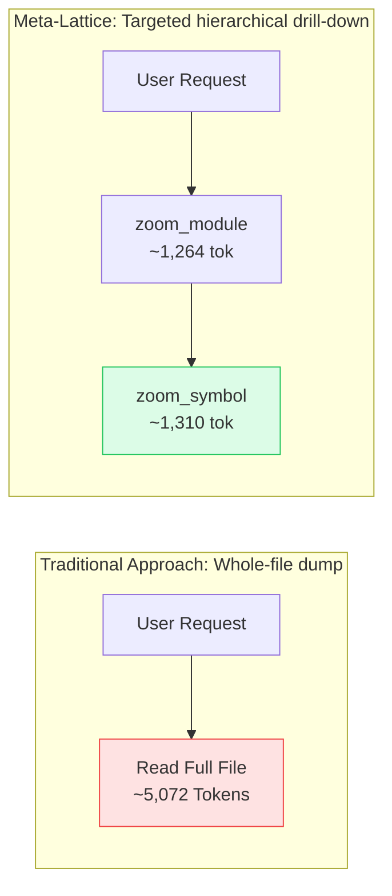

<p align="center">
  <strong>🇺🇸 English</strong> · <a href="utility-and-performance.ko.md">🇰🇷 한국어</a>
</p>

---

# Meta-Lattice: Practical Utility & Performance Evaluation Whitepaper

> **Mechanisms for Reducing AI Coding Agent (Claude Code, OpenAI Codex, Google Antigravity) Token Consumption and Auditing Architecture in Large Codebases**

---

## Executive Summary

As LLM-based coding agents evolve, developer productivity has skyrocketed. However, in **enterprise monorepos and legacy projects with tens to hundreds of thousands of lines of code**, agents continue to encounter severe structural bottlenecks:

1. **Context Saturation**: Indiscriminate full-file reading (`cat`, `view_file`) exhausts context windows within a few turns, causing rapid escalation of token costs.
2. **Attention Dilution & Hallucination**: Thousands of lines of unneeded implementation details (function bodies, internal logic) flood the context, degrading agent reasoning accuracy and long-term memory.
3. **Blind Refactoring**: When modifying shared utilities or domain models, agents fail to perceive the complete call graph, inadvertently introducing runtime breaking changes.
4. **Architectural Erosion**: To deliver quick solutions, agents often bypass layer boundaries (e.g., importing a Controller directly from a Repository) or introduce circular dependencies (`Cyclic Imports`).

**Meta-Lattice** structures the codebase into a hierarchical property graph—**L0 (Domain) ➔ L1 (Module) ➔ L2 (Interface) ➔ L3 (Symbol)**—backed by an embedded property-graph database. It **progressively injects only the minimal necessary metadata and interface signatures** into the agent's context.

Through this design, Meta-Lattice **drastically cuts token usage (see §1.1 empirical data)**, enables **pre-simulation of change impact (Blast Radius)**, and **automatically validates architectural boundaries**, ensuring safe, autonomous coding even in massive projects.

---

## 1. Quantitative Benchmarks

### 1.1 Token Consumption Comparison: Full File Load vs. Meta-Lattice

> 📏 **Measurement Methodology**: In this repository (`meta-lattice`, 23 Go files), token counts were estimated from actual MCP server responses using `characters ÷ 4` (an approximation subject to tokenizer variations). The comparison target is `src/indexer/cache_engine.go` (811 LOC, ~5,072 tokens).

| Task | Traditional Approach | Meta-Lattice Approach | Savings |
| :--- | :--- | :--- | :--- |
| **Inspect L0 Structure** | Load all sources<br>`~36,906 tokens` | `zoom_overview()` (JSON)<br>`~2,705 tokens` | **~93%** |
| **Inspect L1/L2 Module Interfaces** | Load entire file<br>`~5,072 tokens` | `zoom_module()`<br>`~1,264 tokens` | **~75%** |
| **Inspect L3 Target Function** | Load entire file<br>`~5,072 tokens` | `zoom_symbol()`<br>`~1,310 tokens` | **~74%** |

**Interpretation Notes**
- The `zoom_symbol` response (~1,310 tokens) is larger than reading just the function body alone (~781 tokens). This is because callers/callees, signatures, cyclomatic complexity, metadata, and indented JSON are returned together. The savings are measured against "reading the entire file".
- When inspecting only a single small file, going through all three steps sequentially (2,705 + 1,264 + 1,310 ≈ 5,279 tokens) may slightly exceed reading that single file whole (5,072 tokens). The real leverage occurs when **multiple unknown files must be explored across unfamiliar architecture**, and agents selectively invoke only the exact level needed.
- Savings vary based on file sizes and project structure. Smaller files exhibit proportionally lower token differentials.



---

### 1.2 Indexing & Incremental Cache Sync Latency (Latency & Throughput)

Meta-Lattice incorporates a **2-tier cache engine combining SHA-256 content hashes with file modification times (mtime)** ([`cache_engine.go`](../src/indexer/cache_engine.go)), eliminating redundant full-project re-parsing on subsequent invocations:

> 📏 **Measurement Environment**: Measured using `meta-lattice sync` on macOS (Apple Silicon) across a synthetic Python benchmark project (250 files, ~42,000 LOC, 10 packages, ~7,000 symbols). Values reflect sample runs and will vary across environments.

| Indexing Scenario | Processed Files | Duration (Latency) | Cache Hit Ratio |
| :--- | :--- | :--- | :--- |
| **Cold Start (Initial Full Index)** | 250 files | **~127ms** | 0% (Full AST parse) |
| **No Changes (Subsequent call)** | 250 files | **~46ms** (samples: 46/46/47ms) | 250/250 (100%) |
| **Minor Change (2 files modified)** | 2 modified / 248 unchanged | **~63ms** | 248/250 (99.2%) |

- Even with zero file changes, sync takes ~46ms. This includes file tree traversal, `stat` calls, and loading the ~8.4MB graph database into memory.
- When any file changes, project-wide `IMPORTS` and `CALLS` edges are re-evaluated. Hence, incremental sync cost scales more closely with overall graph edge count than with the number of modified files.
- `audit` and `blast` took ~0.15s and ~0.11s respectively on the same dataset (including process startup and DB loading).
- Scenarios involving branch switches with dozens of changed files on very large repositories have not been profiled.

> ⚡ **Operational Behavior**: If query tools (`zoom_*`, `check_layer_violation`, `estimate_blast_radius`) are called while the index is empty, Meta-Lattice builds the index automatically on the first call. To sync subsequent code modifications, call `sync_index` (or `meta-lattice sync`). CLI commands `zoom`/`audit`/`blast` execute incremental sync automatically before querying.

---

### 1.3 System Resources and Storage Footprint

Unlike heavyweight graph architectures requiring external database servers (Neo4j, Memgraph, etc.), Meta-Lattice runs on an **embedded knowledge graph engine (LatticeDB C bindings with fallback to built-in pure-Go property graph, plus BM25 FTS indexing)**:

```text
[Disk Storage Footprint] (Benchmark project, ~42,000 LOC)
  - .lattice/knowledge.lattice  ~2.5 MB  (Single-file property-graph binary)
  - .lattice/cache_state.json   ~0.5 MB
  - Zero external Docker containers or background daemon processes (Zero-Dependency)

[Memory Footprint]
  - Graph nodes and edges are kept in memory for microsecond traversal;
    memory usage scales linearly with codebase symbol volume.
```

> ⚡ **Binary Persistence**: The single-file property graph (`.lattice/knowledge.lattice`) provides atomic writes and instant cold-boot querying.

---

## 2. Practical Utility

### 2.1 Context Longevity & Token Conservation

* **The Problem**:
  Although contemporary models (Claude 3.5 Sonnet, GPT-4o) feature large context windows (128k–200k tokens), **longer contexts lead to Needle-In-A-Haystack retrieval degradation and Instruction Drift**.
* **Meta-Lattice Solution**:
  - `zoom_module(file_path)` extracts class declarations, method signatures, parameter types, and docstrings while **completely stripping method bodies**.
  - The agent understands the module contract without wasting context on unneeded implementation details.
  - Only the exact target function to be modified is fetched via `zoom_symbol(symbol_name)`. As a result, **agents retain system prompts and initial instructions across extended multi-turn sessions**.

---

### 2.2 Preventing Breaking Changes (Blast Radius Estimation)

* **The Problem**:
  When altering function signatures or DTO fields in common modules, agents often modify code without visibility into cross-domain callers outside their currently open files, resulting in cascading runtime or compile-time failures.
* **Meta-Lattice Solution**:
  - `estimate_blast_radius(symbol_or_path, change_type="signature")` traverses `CALLS`, `IMPORTS`, and `REFERENCES` edges using **reverse BFS up to 4 hops deep** (configurable via `max_hops`). Scoring incorporates hop distance decay ($0.5^{d-1}$), symbol visibility (public 1.8×), change type (signature 2.0×), and domain boundary crossing (1.5×).
  - Note: `REFERENCES` edges are not generated by the current parsers, so traversal primarily relies on `CALLS` and `IMPORTS`.
  - Reports a **Blast Score (0–100 risk rating)** along with the **Top 10 affected consumer call sites (hop distance, file:line, domain, impact score, risk rationale)**.
  - Call relationships are resolved using **name-based heuristics** (same class → same file → imported files; ambiguous matches are omitted). Dynamic invocations may not be captured. This serves as an advisory guardrail, not a compiler replacement.
  - Before editing, the agent inspects impacted call sites, allowing it to supply default arguments or refactor callers simultaneously.

```text
$ meta-lattice blast ParseGoFile --hops 3   (Sample output from this repository)

Blast Score: 100/100 [CRITICAL RISK]
  [Hop 1] TestGoParser               (tests/parser_test.go:80)         Score 54  Direct CALLS consumer in 'tests'
  [Hop 1] CacheEngine.parseFile      (src/indexer/cache_engine.go:228) Score 36  Direct CALLS consumer in 'indexer'
  [Hop 2] CacheEngine.Sync           (src/indexer/cache_engine.go:249) Score 18  Transitive consumer (2 hops away)
  [Hop 3] openWorkspace              (src/main.go:72)                  Score  9  Transitive consumer (3 hops away)
```

---

### 2.3 Enforcing Architecture Boundaries & Cycle Detection

* **The Problem**:
  Focused on swift implementation, AI coding agents frequently violate layered architectural boundaries:
  - Repositories directly importing Controller DTOs (layer names are inferred from path tokens like `controller`, `service`, `repository`, customizable via `.lattice-arch.json`).
  - Circular dependencies (`auth -> user -> token -> auth`) introducing runtime import errors.
* **Meta-Lattice Solution**:
  - `check_layer_violation()` iterates over all indexed `IMPORTS` edges in real-time, detecting **illegal dependency directions (e.g., Repository -> Controller)**.
  - Employs Tarjan's Strongly Connected Components (SCC) algorithm to **detect circular import loops (`A -> B -> C -> A`)** in milliseconds, reporting involved file paths.
  - Automatically triggered via Claude Code's `PostToolUse` hook or Antigravity guardrails after file modifications. The audit **reports** violations to alert the agent without forcibly blocking edits.

---

### 2.4 Multi-Agent Ecosystem Interoperability

Meta-Lattice implements a platform-agnostic **MCP (Model Context Protocol) stdio server** (JSON-RPC 2.0, protocolVersion `2024-11-05`, `tools` capability):

- **Claude Code**: `.claude-plugin/marketplace.json`, slash commands (`/meta-lattice:zoom`, `audit`, `blast`), lifecycle hooks.
- **OpenAI Codex**: `.codex/config.toml`, workspace auto-discovery, embedded `AGENTS.md` guidelines.
- **Google Antigravity**: `.agents/mcp_config.json`, 4 on-demand skills, embedded `GEMINI.md` guidelines.
- **One-Click Installer**: Run `meta-lattice install` once to auto-configure both Codex and Antigravity globally (`--status`, `--uninstall` supported).

---

## 3. Illustrative Scenarios

> ⚠️ The following two scenarios are **hypothetical examples demonstrating tool orchestration**. File names, scores, and token counts are illustrative. For measured token comparisons, refer to §1.1.

### Scenario 1: Modifying Business Logic in an Unfamiliar Monorepo

* **User Request**:  
  *"Increase payment failure automatic retry attempts from 3 to 5."*

#### [Traditional AI Agent Workflow]
1. Runs `grep_search "retry"` ➔ 80+ matching results.
2. Opens 5 potentially relevant files via `view_file` (`~25,000 tokens consumed`).
3. Context window reaches capacity, truncating early conversation history.
4. Spends multiple turns parsing unneeded backoff algorithm implementation details.

#### [Meta-Lattice AI Agent Workflow]
1. `zoom_search(query="retry payment")` ➔ Immediately pinpoints `billing.service.retry_payment_charge`.
2. `zoom_module(file_path="src/billing/service.py")` ➔ Inspects class interface and retry method signature (`~450 tokens`).
3. `zoom_symbol(symbol_name="retry_payment_charge")` ➔ Loads only the exact 15-line method body (`~200 tokens`).
4. `estimate_blast_radius` ➔ Confirms only 1 caller (Payment Controller) and safely updates `max_retries=5`.
5. Locates target function and callers with minimal token expenditure.

---

### Scenario 2: Large-Scale Refactoring & Shared Module Interface Changes

* **User Request**:  
  *"To enhance multi-tenancy security, make tenant_id a required parameter in TokenValidator.verify."*

#### [Traditional AI Agent Workflow]
1. Locates `TokenValidator.verify` definition and updates signature (`def verify(self, token, tenant_id):`).
2. Unaware of external call sites across other domains, replies: "Successfully updated."
3. Running tests or staging server triggers cascading `TypeError: missing 1 required positional argument: 'tenant_id'` exceptions.

#### [Meta-Lattice AI Agent Workflow]
1. Executes `estimate_blast_radius(symbol_or_path="TokenValidator.verify", change_type="signature")`.
2. Receives a **HIGH RISK** warning outlining affected call sites:
   - `src/api/auth_middleware.py:34`
   - `src/billing/webhook.py:52`
   - `src/gateway/proxy.py:91`
3. The agent either provides backward compatibility via `tenant_id: str | None = None` or coordinates simultaneous caller updates verified by subsequent tests.

---

## 4. Expected Benefits and Limitations

Token costs, latency savings, bug reduction rates, and PR rejection metrics have **not been longitudinally benchmarked** across production repositories. Actual benefits should be validated against your project metrics:

| Metric | Evaluation Method |
| :--- | :--- |
| **Token Consumption** | Compare token usage before/after tool adoption for equivalent tasks |
| **Breaking Change Prevention** | Cross-reference `blast` alerts with build/test failure points |
| **Architectural Integrity** | Track `meta-lattice audit` results within CI pipelines |

**Known Limitations**
- Call resolution uses name-based heuristics; ambiguous identifiers sharing identical names across scopes are not linked.
- Python/TypeScript/JavaScript parsers utilize regex/line-based heuristics; complex meta-programming constructs may be bypassed. Go AST parsing is fully precise via `go/ast`.
- Monolithic graph persistence in a single file may experience load overhead in exceptionally large repositories (>100k files).

---

## 5. Conclusion

Meta-Lattice acts as **vital intelligence middleware between massive codebases and modern AI coding agents**:

- **Token Economy**: Substantially cuts token usage when navigating unfamiliar code across multiple files (~93% vs. whole repository load, ~74–75% vs. full file load).
- **Safety**: Pre-computes blast radius simulations and audits architectural boundaries prior to code changes.
- **Universal Compatibility**: Serves Claude Code, OpenAI Codex, and Google Antigravity seamlessly via a unified native MCP architecture.
