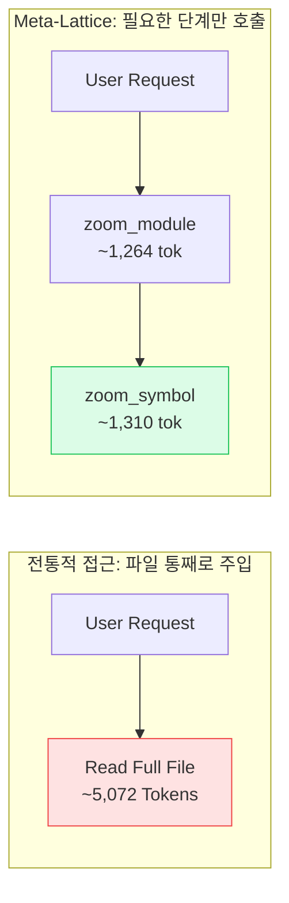

# Meta-Lattice: 실질적 유용성 및 성능 평가 보고서 (Utility & Performance Whitepaper)

> **초대형 코드베이스에서 AI 코딩 에이전트(Claude Code, OpenAI Codex, Google Antigravity)의 토큰 소비 절감 및 아키텍처 점검 메커니즘**

---

## Executive Summary (핵심 요약)

LLM 기반 코딩 에이전트가 발전함에 따라 개발 생산성이 비약적으로 향상되었으나, **수만~수십만 라인의 엔터프라이즈 모노레포 및 레거시 프로젝트**에서는 여전히 심각한 구조적 한계에 직면합니다:

1. **컨텍스트 폭식(Context Saturation)**: 맹목적인 전체 파일 읽기(`cat`, `view_file`)로 인해 질문 몇 번만에 컨텍스트 윈도우 한계에 도달하고 토큰 비용이 급증함.
2. **환각 및 주의력 분산(Attention Dilution)**: 수천 줄의 불필요한 구현부(함수 바디, 내부 로직)가 컨텍스트를 채우면서 에이전트의 추론 정확도와 장기 기억력이 급락함.
3. **사이드 이펙트 맹점(Blind Refactoring)**: 공통 유틸리티나 도메인 모델을 수정할 때 전체 호출 그래프를 인지하지 못해 런타임 브레이킹 체인지를 야기함.
4. **아키텍처 부패(Architectural Erosion)**: 에이전트가 손쉬운 구현을 위해 레이어 경계(예: Repository에서 Controller 참조)를 무시하거나 순환 참조(Cyclic Import)를 생성함.

**Meta-Lattice**는 자체 구현한 임베디드 인메모리 프로퍼티 그래프를 기반으로 소스코드를 **L0(Domain) ➔ L1(Module) ➔ L2(Interface) ➔ L3(Symbol)** 단위의 프로퍼티 그래프로 구조화하여, 에이전트에게 필요한 **최소한의 메타데이터와 인터페이스 시그니처만 점진적(Progressive)으로 주입**합니다.

이를 통해 **토큰 소비를 줄이고(1.1절 실측 참고)**, **변경 영향 반경(Blast Radius) 사전 시뮬레이션** 및 **아키텍처 규칙 자동 검증**을 통해 대규모 프로젝트에서도 안전한 자동 코딩을 가능하게 합니다.

---

## 1. 정량적 성능 벤치마크 (Quantitative Benchmarks)

### 1.1 토큰 소비량 비교: 전체 파일 로드 vs Meta-Lattice

> 📏 **측정 방법**: 이 저장소(`meta-lattice`, Go 23개 파일)에서 MCP 서버의 실제 응답을 받아 `문자 수 ÷ 4`로 토큰을 추정했습니다(토크나이저별 오차가 있는 근사치). 비교 대상은 `src/indexer/cache_engine.go`(811 LOC, 약 5,072 tokens)입니다.

| 작업 | 기존 방식 | Meta-Lattice 방식 | 절감률 |
| :--- | :--- | :--- | :--- |
| **L0 구조 파악** | 전체 소스 로드<br>`~36,906 tokens` | `zoom_overview()` (JSON)<br>`~2,705 tokens` | **약 93%** |
| **L1/L2 모듈 인터페이스 확인** | 파일 전체 로드<br>`~5,072 tokens` | `zoom_module()`<br>`~1,264 tokens` | **약 75%** |
| **L3 타깃 함수 확인** | 파일 전체 로드<br>`~5,072 tokens` | `zoom_symbol()`<br>`~1,310 tokens` | **약 74%** |

**해석 시 주의할 점**
- `zoom_symbol` 응답(1,310)은 함수 본문만 읽는 경우(약 781 tokens)보다 큽니다. 호출자/피호출자, 시그니처, 복잡도 등 메타데이터와 들여쓰기된 JSON이 함께 반환되기 때문입니다. 절감 효과는 "파일 전체를 읽는 것" 대비입니다.
- 한 파일만 볼 때는 세 단계를 모두 거치면(2,705 + 1,264 + 1,310 ≈ 5,279 tokens) 파일 하나를 통째로 읽는 것(5,072)보다 **오히려 큽니다**. 이득은 구조를 모르는 상태에서 **여러 파일을 읽어야 할 때** 생기며, 필요한 단계만 골라 호출할 때 가장 큽니다.
- 절감률은 파일 크기와 구조에 따라 크게 달라집니다. 작은 파일일수록 줄어듭니다.



---

### 1.2 인덱싱 및 증분 동기화 속도 (Latency & Throughput)

Meta-Lattice는 **파일 SHA-256 해시와 수정 시각(mtime)을 결합한 2단계 캐시 엔진**([`cache_engine.go`](../src/indexer/cache_engine.go))을 탑재하여, 매 호출 시 전체 프로젝트를 다시 파싱하지 않습니다:

> 📏 **측정 환경**: 합성 Python 프로젝트(250개 파일, 약 42,000 LOC, 10개 패키지, 심볼 약 7,000개)를 macOS(Apple Silicon)에서 `meta-lattice sync`로 측정한 값입니다. 각 값은 한두 번 실행한 결과이며 환경에 따라 달라집니다.

| 인덱싱 시나리오 | 처리 대상 파일 수 | 소요 시간 (Latency) | 캐시 적중 |
| :--- | :--- | :--- | :--- |
| **Cold Start (최초 전체 인덱싱)** | 250개 파일 | **약 127ms** | 0% (전체 파싱) |
| **No Changes (변경 없는 상태)** | 250개 파일 | **약 46ms** (3회 측정: 46/46/47) | 250/250 |
| **Minor Change (2개 파일 수정)** | 2개 수정 / 248개 유지 | **약 63ms** | 248/250 |

- 변경이 없을 때도 약 46ms가 걸립니다. 파일 스캔과 `stat` 외에 약 8.4MB의 그래프 DB를 읽어 들이는 비용이 포함된 것으로 보이지만(프로파일링은 하지 않은 추정), 구성 요소별로 분해해 측정하지는 않았습니다.
- 파일이 하나라도 바뀌면 전체 `IMPORTS`/`CALLS` 엣지를 다시 해석합니다(코드 기준). 그래서 수정 비용은 변경 파일 수보다 저장소 전체 크기의 영향을 더 받습니다.
- `audit`과 `blast`는 같은 데이터에서 각각 약 0.15초, 0.11초가 걸렸습니다(프로세스 시작과 DB 로드 포함).
- 브랜치 전환처럼 수십 개 파일이 바뀌는 시나리오와 더 큰 코드베이스는 측정하지 않았습니다.

> ⚡ **동작 특성**: 그래프가 비어 있는 상태에서 조회 도구(`zoom_*`, `check_layer_violation`, `estimate_blast_radius`)를 처음 호출하면 자동으로 인덱싱합니다. 이후 코드 변경을 반영하려면 `sync_index`(또는 `meta-lattice sync`)를 호출하세요. CLI의 `zoom`/`audit`/`blast` 명령은 실행 시마다 증분 동기화를 수행합니다.

---

### 1.3 시스템 리소스 및 저장 공간

외부 데이터베이스 서버(Neo4j, Memgraph 등)를 요구하는 무거운 아키텍처와 달리, Meta-Lattice는 **임베디드 지식 그래프 LatticeDB (C 바인딩 및 내장 BM25 FTS 인덱싱)**로 구동됩니다:

```text
[디스크 저장 공간] (위 합성 프로젝트, 약 42,000 LOC 기준)
  - .lattice/knowledge.lattice 약 2.5 MB  (LatticeDB 바이너리 그래프 파일)
  - .lattice/cache_state.json 약 0.5 MB
  - 별도 Docker 컨테이너 / 백그라운드 데몬 프로세스 불필요 (Zero-Dependency)

[메모리 사용량]
  - 그래프 전체를 메모리에 올리는 구조이므로 코드베이스 크기에 비례해 늘어납니다.
```

> ⚡ **바이너리 영속화**: 단일 바이너리 지식 그래프 파일(`.lattice/knowledge.lattice`)을 활용하여 고속 쿼리 및 원자적(atomic) 저장을 보장합니다.

---

## 2. 실질적인 핵심 유용성 (Practical Utility)

### 2.1 토큰 소비 절감 및 컨텍스트 지속성 유지 (Context Longevity)

* **문제점**:
  최신 LLM(Claude 3.5 Sonnet, GPT-4o)의 컨텍스트 윈도우가 128k~200k로 늘어났지만, **컨텍스트가 길어질수록 니들인어헤이스택(Needle-In-A-Haystack) 검색 정확도가 떨어지고 지시사항 망각(Instruction Drift)**이 발생합니다.
* **Meta-Lattice 유용성**:
  - `zoom_module(file_path)`은 클래스 선언과 메서드 시그니처, 파라미터 타입, 독스트링만 추출하고 **메서드 본문(Body)을 완벽히 제거**하여 반환합니다.
  - 에이전트는 파일의 전체 역할과 계약(Contract)을 파악하면서도 불필요한 구현 코드로 컨텍스트를 낭비하지 않습니다.
  - 실제로 수정할 대상 함수만 `zoom_symbol(symbol_name)`으로 정밀 호출하므로, **장기 세션에서도 에이전트가 초기 컨텍스트와 시스템 프롬프트를 잊지 않고 일관된 품질을 유지**합니다.

---

### 2.2 브레이킹 체인지 사전 차단 (Blast Radius Estimation)

* **문제점**:
  공통 모듈의 함수 시그니처나 DTO 필드를 변경할 때, 에이전트는 자신이 직접 열어본 파일 외에 다른 도메인에서 해당 함수를 어떻게 호출하고 있는지 모른 채 코드를 수정합니다. 이는 컴파일 타임 또는 런타임에 연쇄 에러를 유발합니다.
* **Meta-Lattice 유용성**:
  - `estimate_blast_radius(symbol_or_path, change_type="signature")`를 통해 변경 대상 노드에서 `CALLS`/`IMPORTS`/`REFERENCES` 엣지를 **역방향 BFS로 최대 4-Hop(기본값, `max_hops`로 조정) 깊이까지** 탐색합니다. 점수는 홉 거리 감쇠(0.5^(d-1)), 심볼 가시성(public 1.8배), 변경 유형(signature 2.0배 등), 도메인 교차(1.5배) 가중치의 합으로 계산합니다. PageRank나 데이터 플로우 분석은 하지 않습니다.
  - `REFERENCES` 엣지는 현재 파서가 생성하지 않으므로 실제로는 `CALLS`와 `IMPORTS`가 주로 사용됩니다.
  - **Blast Score (0~100 위험도 점수)**와 함께 연쇄 파급을 받는 **Top 10 지점(Hop 거리, 호출 파일:라인, 도메인, 영향도 점수, 위험도 설명)**을 브리핑합니다.
  - 호출 관계는 **이름 기반 휴리스틱**으로 해석하므로(동일 클래스 → 동일 파일 → import된 파일 순, 후보가 여럿이면 연결하지 않음), 동적 호출이나 동명 함수가 많은 경우 누락될 수 있습니다. 결과는 참고용이며 컴파일러/테스트를 대체하지 않습니다.
  - 에이전트는 코드를 수정하기 전, 영향받는 호출 지점들을 사전에 파악하여 기본값(Default Parameter)을 추가하거나 호출부를 동시에 수정할 수 있습니다.

```text
$ meta-lattice blast ParseGoFile --hops 3   (이 저장소에서 실행한 결과 일부)

Blast Score: 100/100 [CRITICAL RISK]
  [Hop 1] TestGoParser               (tests/parser_test.go:80)         Score 54  Direct CALLS consumer in 'tests'
  [Hop 1] CacheEngine.parseFile      (src/indexer/cache_engine.go:228) Score 36  Direct CALLS consumer in 'indexer'
  [Hop 2] CacheEngine.Sync           (src/indexer/cache_engine.go:249) Score 18  Transitive consumer (2 hops away)
  [Hop 3] openWorkspace              (src/main.go:72)                  Score  9  Transitive consumer (3 hops away)
```

---

### 2.3 아키텍처 부패 및 순환 참조 방지 (Architecture Boundary Auditor)

* **문제점**:
  빠른 기능 구현에만 집중하는 AI 에이전트는 레이어드 아키텍처 규칙을 쉽게 무시합니다:
  - Repository가 Controller의 DTO를 직접 import
  (레이어는 파일명/디렉터리명의 토큰(`controller`, `service`, `repository` 등)으로 추정하며, `.lattice-arch.json`으로 규칙을 바꿀 수 있습니다)
  - 모듈 간 순환 참조 발생 (`auth -> user -> token -> auth`)으로 런타임 `ImportError` 유발
* **Meta-Lattice 유용성**:
  - `check_layer_violation()`은 그래프에 인덱싱된 모든 `IMPORTS` 엣지를 실시간 순회하여 **위반된 레이어 의존성(예: Repository -> Controller)**을 즉시 감지합니다.
  - Tarjan의 강결합 컴포넌트(SCC) 알고리즘을 통해 **사이클(`A -> B -> C -> A`)을 찾아내고**(위 250개 파일 합성 프로젝트에서 `audit` 전체가 약 0.15초), 사이클에 연루된 모듈 경로를 정확히 리포트합니다.
  - Claude Code의 `PostToolUse` 훅 또는 Antigravity의 가드레일 규칙을 통해 **파일 수정 직후 자동으로 감사가 실행**됩니다(이 저장소의 `hooks/hooks.json`은 Claude Code `PostToolUse` 훅에서 `audit`을 실행). 감사는 위반을 **보고**하며 수정 자체를 막지는 않습니다.

---

### 2.4 다중 에이전트 생태계 통합 호환성 (Multi-Agent Interoperability)

Meta-Lattice는 특정 툴에 종속되지 않는 **MCP(Model Context Protocol) stdio 서버**(JSON-RPC 2.0, protocolVersion `2024-11-05`, `tools` 기능만 지원)를 구현했습니다. 통합 설정 파일을 제공하는 플랫폼은 다음과 같습니다:

- **Claude Code**: `.claude-plugin/marketplace.json`, 슬래시 커맨드(`/meta-lattice:zoom`, `audit`, `blast`), 생명주기 훅 지원
- **OpenAI Codex**: `.codex/config.toml`, 프로젝트 자동 감지 및 `AGENTS.md` 가이드라인 내장
- **Google Antigravity**: `.agents/mcp_config.json`, 온디맨드 스킬 4종 및 `GEMINI.md` 제공
- **원클릭 통합 인스톨러**: `meta-lattice install` 한 번으로 Codex와 Antigravity 전역 설정을 자동 완료 (`--status`, `--uninstall` 지원)

---

## 3. 사용 시나리오 (Illustrative Scenarios)

> ⚠️ 아래 두 시나리오는 **도구를 어떻게 조합해 쓰는지 보여 주는 가상의 예시**입니다. 파일명, 점수, 토큰 수는 실측값이 아닙니다. 실측 토큰 비교는 1.1절을 참고하세요.

### 시나리오 1: 낯선 모노레포에서 특정 비즈니스 로직 수정하기

* **사용자 요구사항**:  
  *"사용자 결제 실패 시 자동 재시도하는 로직의 횟수를 3회에서 5회로 늘려주세요."*

#### [기존 AI 에이전트의 동작]
1. `grep_search "retry"` 실행 ➔ 80여 개 결과 반환.
2. 관련 있어 보이는 파일 5개를 무작정 `view_file`로 열어봄 (`~25,000 토큰 소모`).
3. 컨텍스트가 가득 차서 에이전트의 이전 기억이 소실됨.
4. 실제로 고치지 않아도 될 백오프 알고리즘 내부 구현까지 읽느라 턴 소모.

#### [Meta-Lattice를 사용하는 AI 에이전트의 동작]
1. `zoom_search(query="retry payment")` ➔ `billing.service.retry_payment_charge` 노드 즉시 특정.
2. `zoom_module(file_path="src/billing/service.py")` ➔ 클래스 인터페이스 및 재시도 관련 메서드 구조 확인 (`~450 토큰`).
3. `zoom_symbol(symbol_name="retry_payment_charge")` ➔ 해당 메서드의 본문 15줄만 정확히 로드 (`~200 토큰`).
4. `estimate_blast_radius` ➔ 호출자가 결제 컨트롤러 1곳임을 확인 후 안전하게 `max_retries=5`로 수정.
5. 필요한 단계만 호출하므로 파일 전체를 여러 개 여는 방식보다 적은 토큰으로 대상 함수와 호출자를 특정할 수 있습니다(절감률은 저장소에 따라 다름).

---

### 시나리오 2: 대규모 리팩터링 및 공통 모듈 명칭 변경

* **사용자 요구사항**:  
  *"보안 강화를 위해 TokenValidator의 verify 메서드에 tenant_id 인자를 필수로 추가해주세요."*

#### [기존 AI 에이전트의 동작]
1. `TokenValidator.verify` 정의부를 찾아 수정 (`def verify(self, token, tenant_id):`).
2. 어디에서 이 함수를 호출하고 있는지 알지 못해 "수정 완료했습니다"라고 답변.
3. 테스트를 돌리거나 실서버 구동 시 `TypeError: missing 1 required positional argument: 'tenant_id'` 연쇄 폭탄 발생.

#### [Meta-Lattice를 사용하는 AI 에이전트의 동작]
1. `estimate_blast_radius(symbol_or_path="TokenValidator.verify", change_type="signature")` 실행.
2. 다음과 같은 결과가 나올 수 있습니다(예시): **HIGH 등급** 경고와 함께 호출 지점이 나열됩니다:
   - `src/api/auth_middleware.py:34`
   - `src/billing/webhook.py:52`
   - `src/gateway/proxy.py:91`
   - 등 호출 지점과 파일 위치가 도출됨 (이름 기반 해석이므로 동적 호출은 누락될 수 있음).
3. 에이전트는 `tenant_id: str | None = None`으로 하위 호환성을 제공하거나, 나열된 호출 지점을 수정한 뒤 테스트/빌드로 최종 확인함.

---

## 4. 기대 효과와 한계

이 저장소에서는 토큰 비용, 응답 시간, 버그 감소율, PR 반려 건수를 **측정하지 않았습니다.** 이전 판에 있던 ROI 표(토큰 81% 절감, 버그 월 12건 → 1건 미만 등)는 근거가 없어 삭제했습니다. 실제 효과는 다음을 직접 측정해 판단하세요.

| 지표 | 측정 방법 |
| :--- | :--- |
| 토큰 소모량 | 같은 작업을 도구 사용 전/후로 수행하며 에이전트의 토큰 사용량 비교 |
| 브레이킹 변경 사전 탐지 | `blast` 결과와 실제 컴파일/테스트 실패 지점을 비교 |
| 아키텍처 위반 | CI에서 `meta-lattice audit` 결과 추적 |

**알려진 한계**
- 호출/참조 해석은 이름 기반 휴리스틱이며, 동명 함수가 여럿이면 연결하지 않습니다.
- Python/TypeScript/JavaScript 파서는 정규식 기반이라 복잡한 문법에서 누락될 수 있습니다. Go만 `go/ast`로 정확히 파싱합니다.
- 그래프 전체를 단일 JSON 파일에 저장하므로 매우 큰 저장소에서는 로드 시간이 늘 수 있습니다.

---

## 5. 결론 (Conclusion)

Meta-Lattice는 단순한 검색 툴이 아닌, **대규모 코드베이스와 최신 AI 코딩 에이전트 사이의 필수 인텔리전스 미들웨어(Intelligence Middleware)**입니다.

- **토큰 경제성**: 구조를 모르는 상태에서 여러 파일을 읽어야 할 때 토큰을 크게 줄입니다(측정 예: 전체 소스 대비 약 93%, 단일 파일 대비 약 74~75%). 단일 파일만 볼 때는 이점이 작거나 없습니다.
- **안전성**: 영향 반경 시뮬레이션과 아키텍처 감사기로 변경 전에 위험 지점을 미리 파악하도록 돕습니다. 결과는 휴리스틱이므로 테스트와 빌드를 대체하지 않습니다.
- **범용성**: Claude Code, OpenAI Codex, Google Antigravity에서 같은 MCP 서버를 쓸 수 있습니다.
